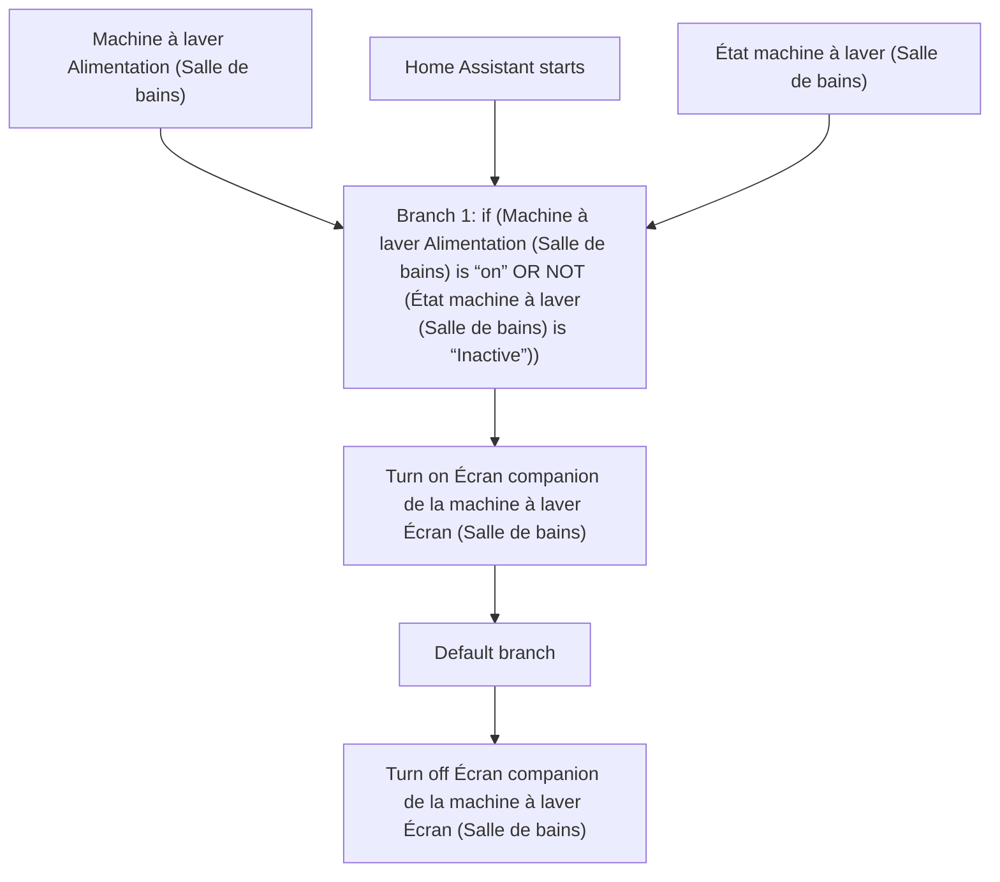
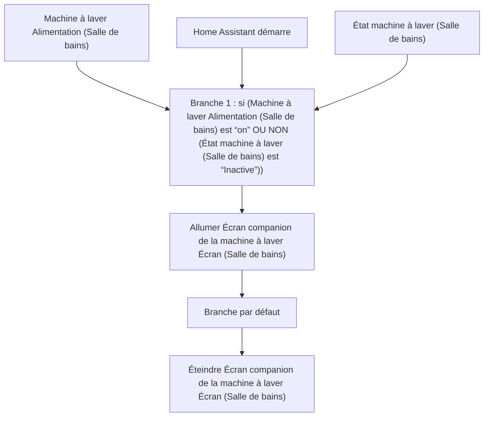

# Machine à laver - Alimentation écran companion / Machine à laver - Alimentation écran companion

## English
- Back to guest-friendly view: [smart_washing_machine](../../../aspects/smart_washing_machine.md)
- Back to technical aspect index: [smart_washing_machine](../smart_washing_machine.md)

### Summary
- Runs when: Machine à laver Alimentation (Salle de bains); Home Assistant starts; État machine à laver (Salle de bains)
- Only if: No extra conditions
- Then: Branch 1: if (Machine à laver Alimentation (Salle de bains) is “on” OR NOT (État machine à laver (Salle de bains) is “Inactive”)); Turn on Écran companion de la machine à laver Écran (Salle de bains); Default branch; Turn off Écran companion de la machine à laver Écran (Salle de bains)

## Français
- Retour vers la vue “invité” : [smart_washing_machine](../../../aspects/smart_washing_machine.md)
- Retour vers l’index technique de l’aspect : [smart_washing_machine](../smart_washing_machine.md)

### Résumé
- Se déclenche quand : Machine à laver Alimentation (Salle de bains); Home Assistant démarre; État machine à laver (Salle de bains)
- Uniquement si : Pas de condition supplémentaire
- Ensuite : Branche 1 : si (Machine à laver Alimentation (Salle de bains) est “on” OU NON (État machine à laver (Salle de bains) est “Inactive”)); Allumer Écran companion de la machine à laver Écran (Salle de bains); Branche par défaut; Éteindre Écran companion de la machine à laver Écran (Salle de bains)

