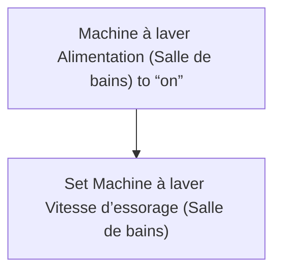
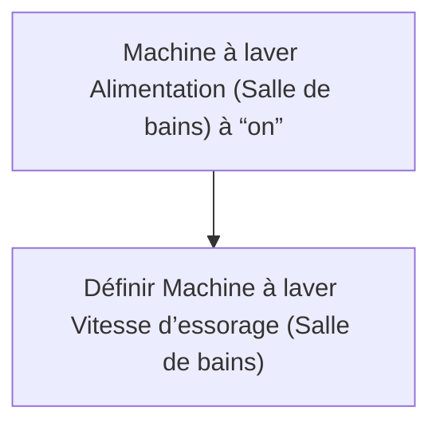

# Machine à laver - Essorage par défaut / Machine à laver - Essorage par défaut

## English
- Back to guest-friendly view: [smart_washing_machine](../../../aspects/smart_washing_machine.md)
- Back to technical aspect index: [smart_washing_machine](../smart_washing_machine.md)

### Summary
- Runs when: Machine à laver Alimentation (Salle de bains) to “on”
- Only if: No extra conditions
- Then: Set Machine à laver Vitesse d’essorage (Salle de bains)

## Français
- Retour vers la vue “invité” : [smart_washing_machine](../../../aspects/smart_washing_machine.md)
- Retour vers l’index technique de l’aspect : [smart_washing_machine](../smart_washing_machine.md)

### Résumé
- Se déclenche quand : Machine à laver Alimentation (Salle de bains) à “on”
- Uniquement si : Pas de condition supplémentaire
- Ensuite : Définir Machine à laver Vitesse d’essorage (Salle de bains)

