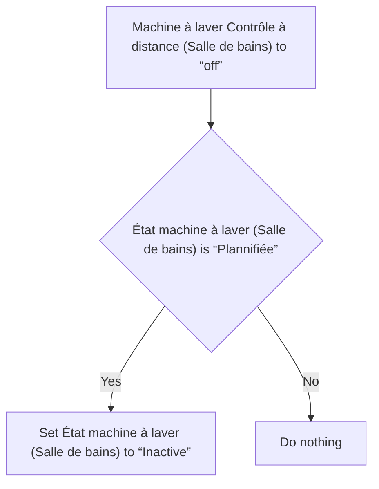
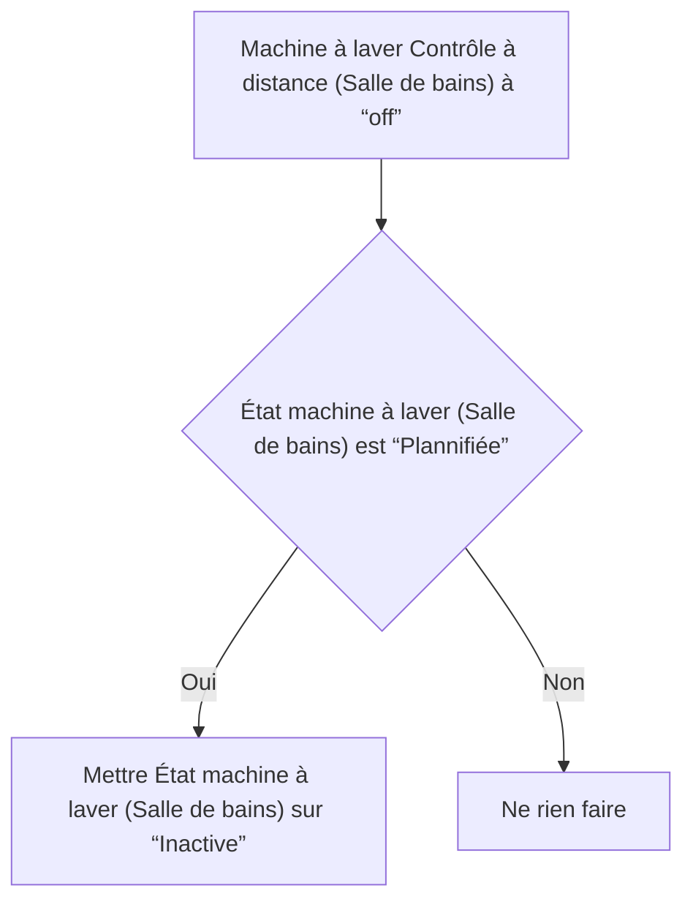

# Machine à laver - État « inactive » depuis planifiée / Machine à laver - État « inactive » depuis planifiée

## English
- Back to guest-friendly view: [smart_washing_machine](../../../aspects/smart_washing_machine.md)
- Back to technical aspect index: [smart_washing_machine](../smart_washing_machine.md)

### Summary
- Runs when: Machine à laver Contrôle à distance (Salle de bains) to “off”
- Only if: État machine à laver (Salle de bains) is “Plannifiée”
- Then: Set État machine à laver (Salle de bains) to “Inactive”

## Français
- Retour vers la vue “invité” : [smart_washing_machine](../../../aspects/smart_washing_machine.md)
- Retour vers l’index technique de l’aspect : [smart_washing_machine](../smart_washing_machine.md)

### Résumé
- Se déclenche quand : Machine à laver Contrôle à distance (Salle de bains) à “off”
- Uniquement si : État machine à laver (Salle de bains) est “Plannifiée”
- Ensuite : Mettre État machine à laver (Salle de bains) sur “Inactive”

