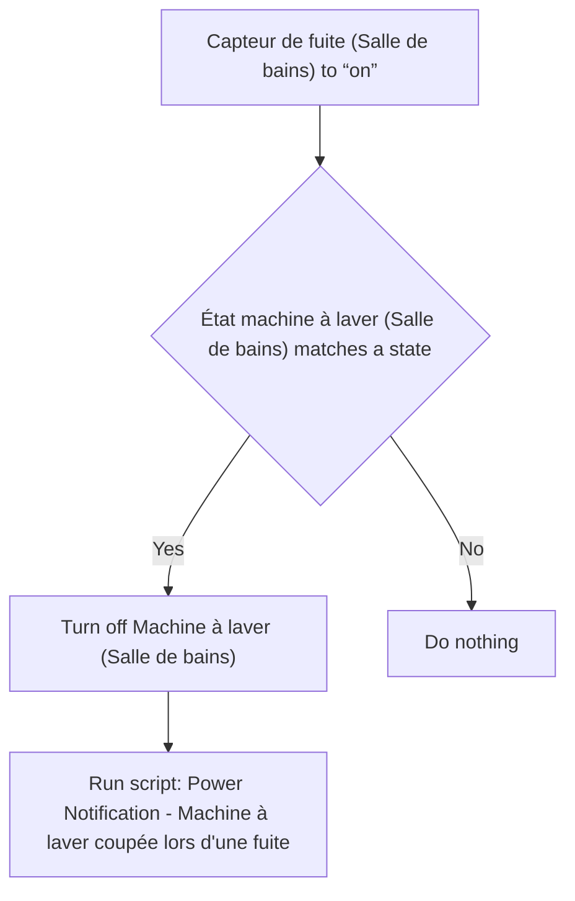
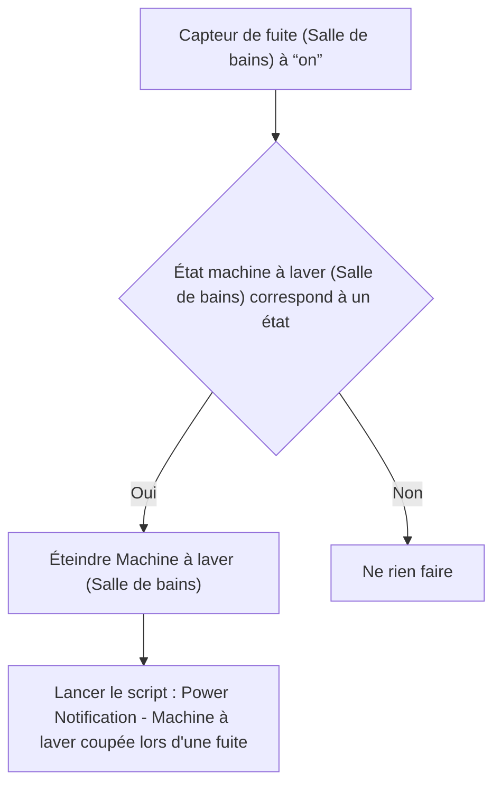

# Machine à laver - Couper lors d'une fuite / Machine à laver - Couper lors d'une fuite

## English
- Back to guest-friendly view: [smart_washing_machine](../../../aspects/smart_washing_machine.md)
- Back to technical aspect index: [smart_washing_machine](../smart_washing_machine.md)

### Summary
- Runs when: Capteur de fuite (Salle de bains) to “on”
- Only if: État machine à laver (Salle de bains) matches a state
- Then: Turn off Machine à laver (Salle de bains); Run script: Power Notification - Machine à laver coupée lors d'une fuite

### Scripts called
- [Power Notification - Machine à laver coupée lors d'une fuite](../../scripts/power_notification_machine_a_laver_coupee_lors_d_une_fuite.md)

## Français
- Retour vers la vue “invité” : [smart_washing_machine](../../../aspects/smart_washing_machine.md)
- Retour vers l’index technique de l’aspect : [smart_washing_machine](../smart_washing_machine.md)

### Résumé
- Se déclenche quand : Capteur de fuite (Salle de bains) à “on”
- Uniquement si : État machine à laver (Salle de bains) correspond à un état
- Ensuite : Éteindre Machine à laver (Salle de bains); Lancer le script : Power Notification - Machine à laver coupée lors d'une fuite

### Scripts appelés
- [Power Notification - Machine à laver coupée lors d'une fuite](../../scripts/power_notification_machine_a_laver_coupee_lors_d_une_fuite.md)

