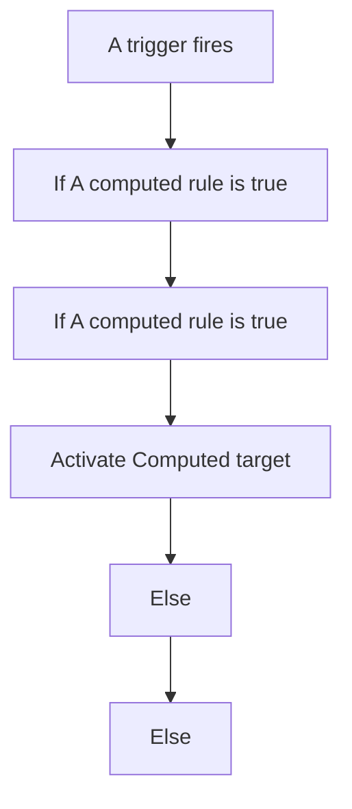
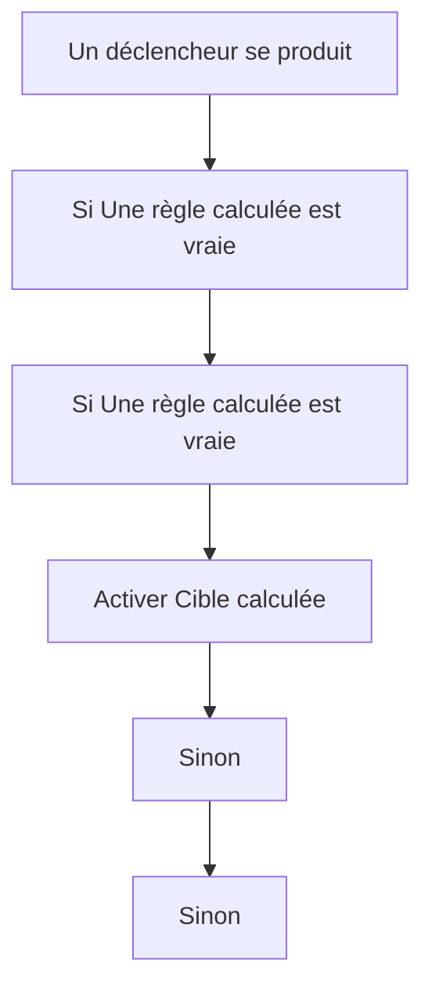

# Assist - 📣 Réinitialiser la lumière / Assist - 📣 Réinitialiser la lumière

## English
- Back to guest-friendly view: [voice_commands](../../../aspects/voice_commands.md)
- Back to technical aspect index: [voice_commands](../voice_commands.md)

### Summary
- Runs when: A trigger fires
- Only if: No extra conditions
- Then: If A computed rule is true; If A computed rule is true; Activate Computed target; Else; Else

## Français
- Retour vers la vue “invité” : [voice_commands](../../../aspects/voice_commands.md)
- Retour vers l’index technique de l’aspect : [voice_commands](../voice_commands.md)

### Résumé
- Se déclenche quand : Un déclencheur se produit
- Uniquement si : Pas de condition supplémentaire
- Ensuite : Si Une règle calculée est vraie; Si Une règle calculée est vraie; Activer Cible calculée; Sinon; Sinon

