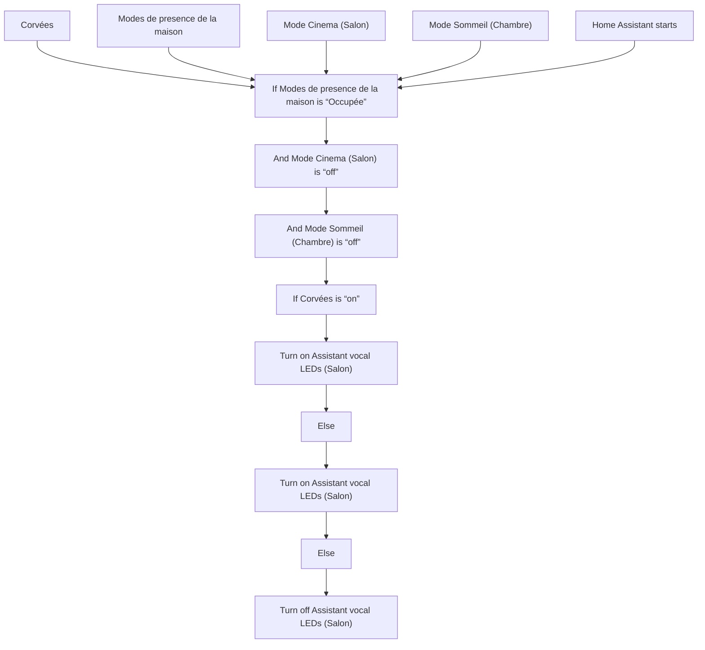
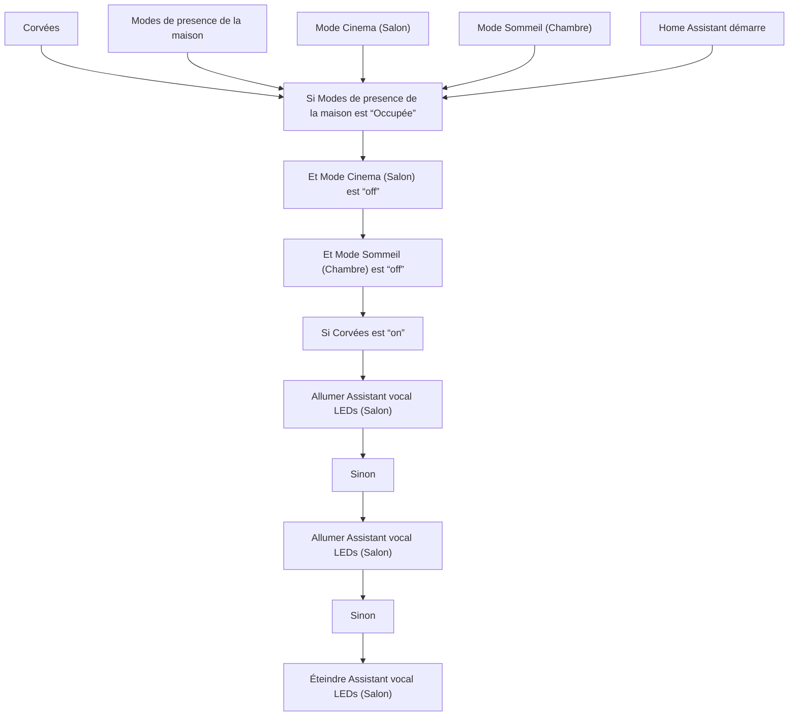

# Voicekit Rez-de-Chaussée - Afficher corvées / Voicekit Rez-de-Chaussée - Afficher corvées

## English
- Back to guest-friendly view: [voice_commands](../../../aspects/voice_commands.md)
- Back to technical aspect index: [voice_commands](../voice_commands.md)

### Summary
- Runs when: Corvées; Modes de presence de la maison; Mode Cinema (Salon); Mode Sommeil (Chambre); Home Assistant starts
- Only if: No extra conditions
- Then: If Modes de presence de la maison is “Occupée”; And Mode Cinema (Salon) is “off”; And Mode Sommeil (Chambre) is “off”; If Corvées is “on”; Turn on Assistant vocal LEDs (Salon); Else; Turn on Assistant vocal LEDs (Salon); Else; Turn off Assistant vocal LEDs (Salon)

## Français
- Retour vers la vue “invité” : [voice_commands](../../../aspects/voice_commands.md)
- Retour vers l’index technique de l’aspect : [voice_commands](../voice_commands.md)

### Résumé
- Se déclenche quand : Corvées; Modes de presence de la maison; Mode Cinema (Salon); Mode Sommeil (Chambre); Home Assistant démarre
- Uniquement si : Pas de condition supplémentaire
- Ensuite : Si Modes de presence de la maison est “Occupée”; Et Mode Cinema (Salon) est “off”; Et Mode Sommeil (Chambre) est “off”; Si Corvées est “on”; Allumer Assistant vocal LEDs (Salon); Sinon; Allumer Assistant vocal LEDs (Salon); Sinon; Éteindre Assistant vocal LEDs (Salon)

