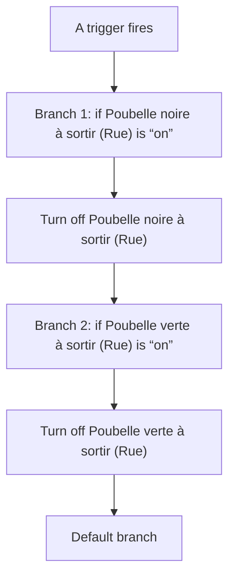
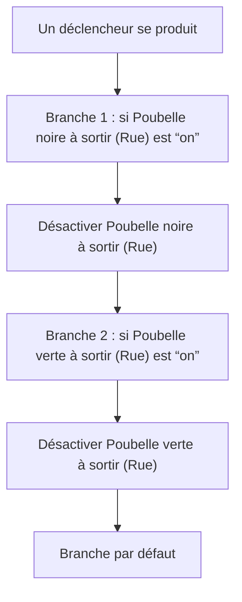

# Assist - Poubelles sorties par la voix / Assist - Poubelles sorties par la voix

## English
- Back to guest-friendly view: [voice_commands](../../../aspects/voice_commands.md)
- Back to technical aspect index: [voice_commands](../voice_commands.md)

### Summary
- Runs when: A trigger fires
- Only if: No extra conditions
- Then: Branch 1: if Poubelle noire à sortir (Rue) is “on”; Turn off Poubelle noire à sortir (Rue); Branch 2: if Poubelle verte à sortir (Rue) is “on”; Turn off Poubelle verte à sortir (Rue); Default branch

## Français
- Retour vers la vue “invité” : [voice_commands](../../../aspects/voice_commands.md)
- Retour vers l’index technique de l’aspect : [voice_commands](../voice_commands.md)

### Résumé
- Se déclenche quand : Un déclencheur se produit
- Uniquement si : Pas de condition supplémentaire
- Ensuite : Branche 1 : si Poubelle noire à sortir (Rue) est “on”; Désactiver Poubelle noire à sortir (Rue); Branche 2 : si Poubelle verte à sortir (Rue) est “on”; Désactiver Poubelle verte à sortir (Rue); Branche par défaut

