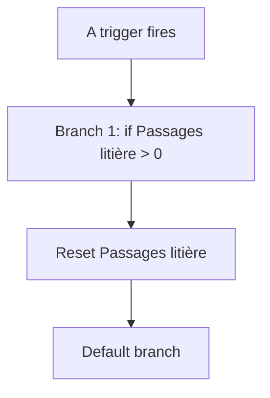
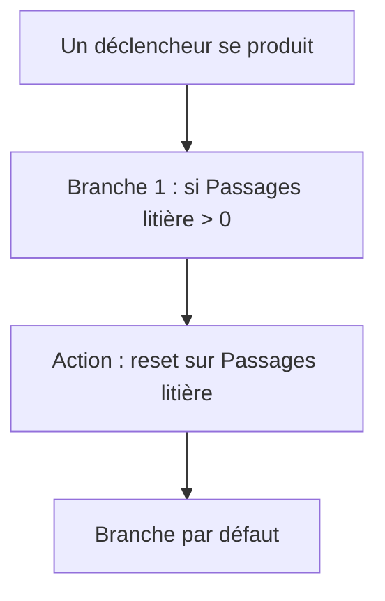

# Assist - Litière nettoyée par la voix / Assist - Litière nettoyée par la voix

## English
- Back to guest-friendly view: [voice_commands](../../../aspects/voice_commands.md)
- Back to technical aspect index: [voice_commands](../voice_commands.md)

### Summary
- Runs when: A trigger fires
- Only if: No extra conditions
- Then: Branch 1: if Passages litière > 0; Reset Passages litière; Default branch

## Français
- Retour vers la vue “invité” : [voice_commands](../../../aspects/voice_commands.md)
- Retour vers l’index technique de l’aspect : [voice_commands](../voice_commands.md)

### Résumé
- Se déclenche quand : Un déclencheur se produit
- Uniquement si : Pas de condition supplémentaire
- Ensuite : Branche 1 : si Passages litière > 0; Action : reset sur Passages litière; Branche par défaut

