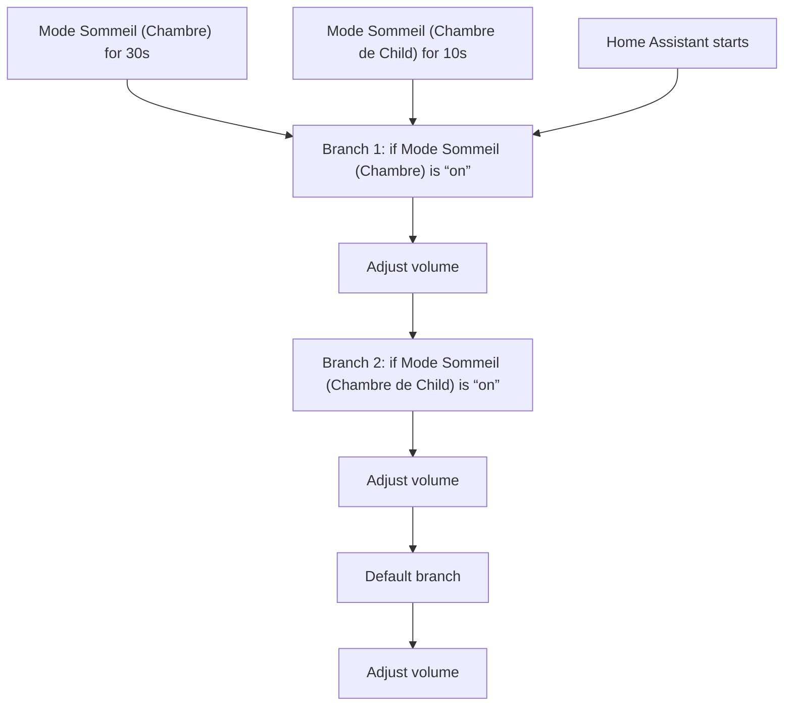
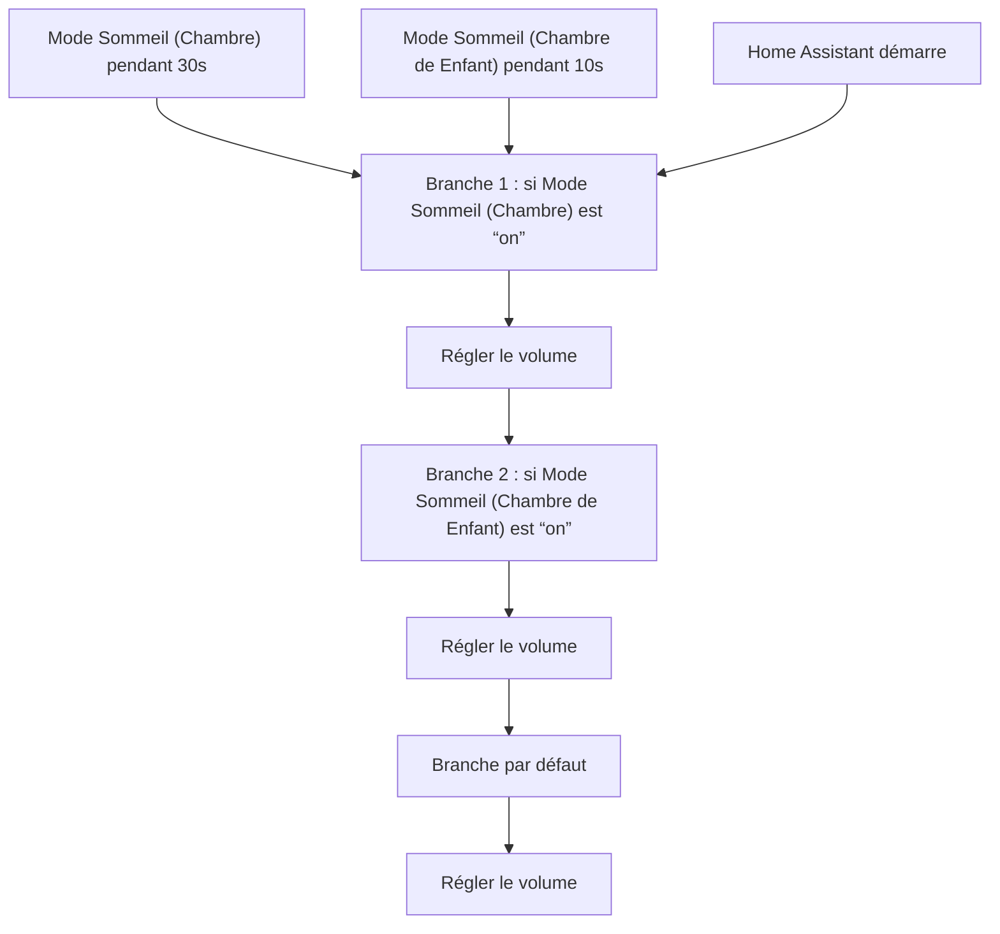

# VoiceKit Chambre - Controller Volume / VoiceKit Chambre - Controller Volume

## English
- Back to guest-friendly view: [voice_commands](../../../aspects/voice_commands.md)
- Back to technical aspect index: [voice_commands](../voice_commands.md)

### Summary
- Runs when: Mode Sommeil (Chambre) for 30s; Mode Sommeil (Chambre de Child) for 10s; Home Assistant starts
- Only if: No extra conditions
- Then: Branch 1: if Mode Sommeil (Chambre) is “on”; Adjust volume; Branch 2: if Mode Sommeil (Chambre de Child) is “on”; Adjust volume; Default branch; Adjust volume

## Français
- Retour vers la vue “invité” : [voice_commands](../../../aspects/voice_commands.md)
- Retour vers l’index technique de l’aspect : [voice_commands](../voice_commands.md)

### Résumé
- Se déclenche quand : Mode Sommeil (Chambre) pendant 30s; Mode Sommeil (Chambre de Enfant) pendant 10s; Home Assistant démarre
- Uniquement si : Pas de condition supplémentaire
- Ensuite : Branche 1 : si Mode Sommeil (Chambre) est “on”; Régler le volume; Branche 2 : si Mode Sommeil (Chambre de Enfant) est “on”; Régler le volume; Branche par défaut; Régler le volume

