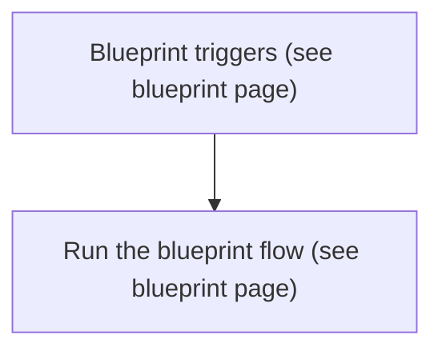
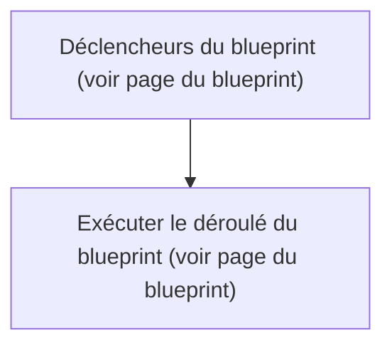

# Réduire volume lorsque assistant vocal en écoute (Cuisine) / Réduire volume lorsque assistant vocal en écoute (Cuisine)

## English
- Back to guest-friendly view: [voice_commands](../../../aspects/voice_commands.md)
- Back to technical aspect index: [voice_commands](../voice_commands.md)

- Implemented via blueprint: [perso/reduce_volume_of_media_player_when_voice_assistant_listening_v2.yaml](../../blueprints/perso/reduce_volume_of_media_player_when_voice_assistant_listening_v2.md)
- For the detailed flow (triggers, logic, branches), see the blueprint page.

### Inputs used
- `assist_satellite_entity`: assist_satellite.vpe_cuisine_satellite_assist
- `custom_target`: (object)

### Summary
- Runs when: Blueprint triggers (see blueprint page)
- Only if: Blueprint logic allows it (see blueprint page)
- Then: Run the blueprint flow (see blueprint page)

## Français
- Retour vers la vue “invité” : [voice_commands](../../../aspects/voice_commands.md)
- Retour vers l’index technique de l’aspect : [voice_commands](../voice_commands.md)

- Basé sur le blueprint : [perso/reduce_volume_of_media_player_when_voice_assistant_listening_v2.yaml](../../blueprints/perso/reduce_volume_of_media_player_when_voice_assistant_listening_v2.md)
- Pour le déroulé détaillé (déclencheurs, logique, branches), voir la page du blueprint.

### Entrées utilisées
- `assist_satellite_entity` : assist_satellite.vpe_cuisine_satellite_assist
- `custom_target` : (objet)

### Résumé
- Se déclenche quand : Déclencheurs du blueprint (voir page du blueprint)
- Uniquement si : La logique du blueprint le permet (voir page du blueprint)
- Ensuite : Exécuter le déroulé du blueprint (voir page du blueprint)

