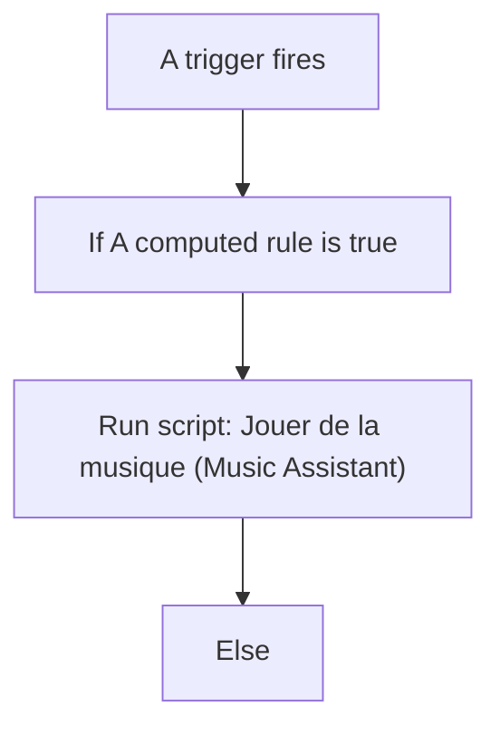
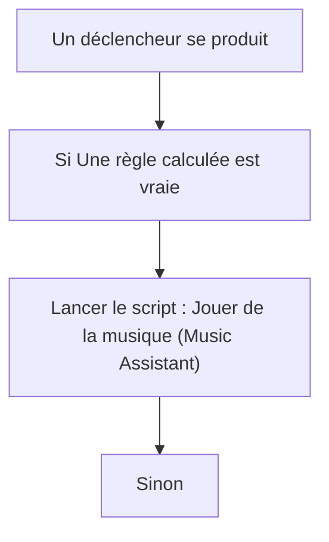

# Jouer de la Musique par la Voix (Music Assistant) / Jouer de la Musique par la Voix (Music Assistant)

## English
- Back to guest-friendly view: [voice_commands](../../../aspects/voice_commands.md)
- Back to technical aspect index: [voice_commands](../voice_commands.md)

### Summary
- Runs when: A trigger fires
- Only if: No extra conditions
- Then: If A computed rule is true; Run script: Jouer de la musique (Music Assistant); Else

### Scripts called
- [Jouer de la musique (Music Assistant)](../../scripts/jouer_de_la_musique_music_assistant.md)

## Français
- Retour vers la vue “invité” : [voice_commands](../../../aspects/voice_commands.md)
- Retour vers l’index technique de l’aspect : [voice_commands](../voice_commands.md)

### Résumé
- Se déclenche quand : Un déclencheur se produit
- Uniquement si : Pas de condition supplémentaire
- Ensuite : Si Une règle calculée est vraie; Lancer le script : Jouer de la musique (Music Assistant); Sinon

### Scripts appelés
- [Jouer de la musique (Music Assistant)](../../scripts/jouer_de_la_musique_music_assistant.md)

