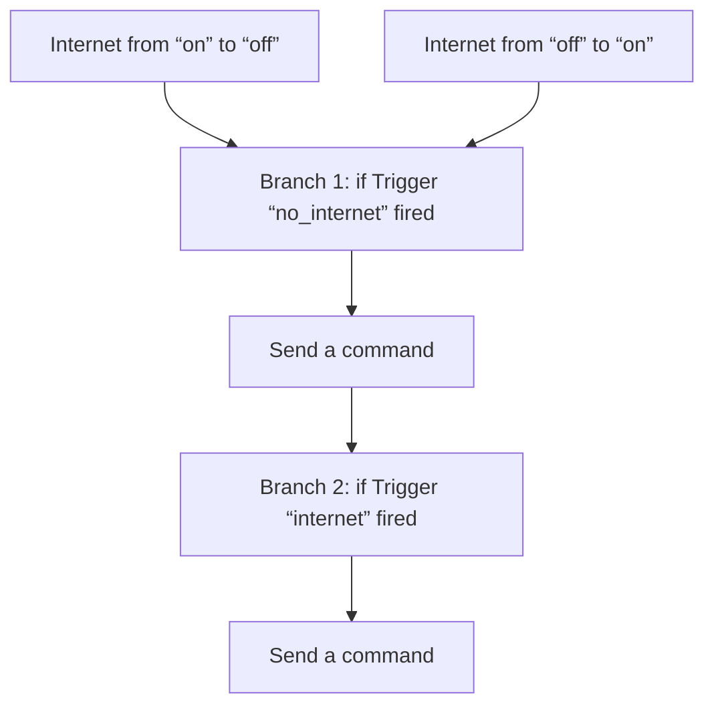
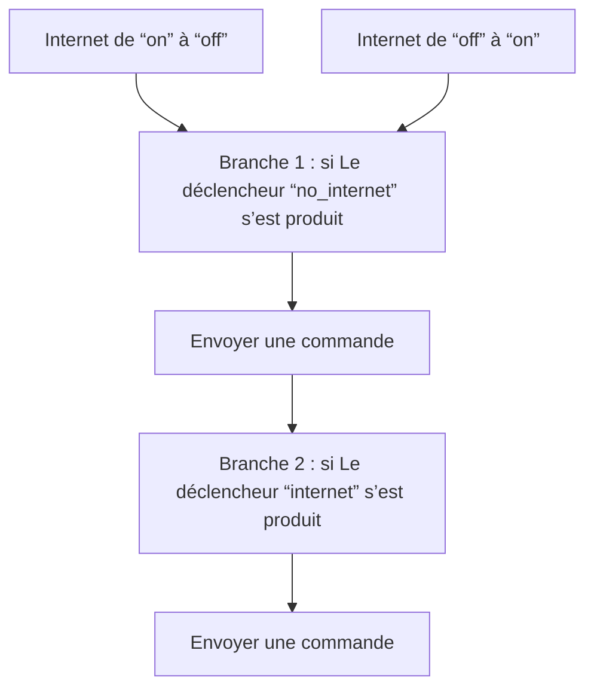

# Assist - Assistant de secours lors d'une panne d'internet / Assist - Assistant de secours lors d'une panne d'internet

## English
- Back to guest-friendly view: [voice_commands](../../../aspects/voice_commands.md)
- Back to technical aspect index: [voice_commands](../voice_commands.md)

### Summary
- Runs when: Internet from “on” to “off”; Internet from “off” to “on”
- Only if: No extra conditions
- Then: Branch 1: if Trigger “no_internet” fired; Send a command; Branch 2: if Trigger “internet” fired; Send a command

## Français
- Retour vers la vue “invité” : [voice_commands](../../../aspects/voice_commands.md)
- Retour vers l’index technique de l’aspect : [voice_commands](../voice_commands.md)

### Résumé
- Se déclenche quand : Internet de “on” à “off”; Internet de “off” à “on”
- Uniquement si : Pas de condition supplémentaire
- Ensuite : Branche 1 : si Le déclencheur “no_internet” s’est produit; Envoyer une commande; Branche 2 : si Le déclencheur “internet” s’est produit; Envoyer une commande

