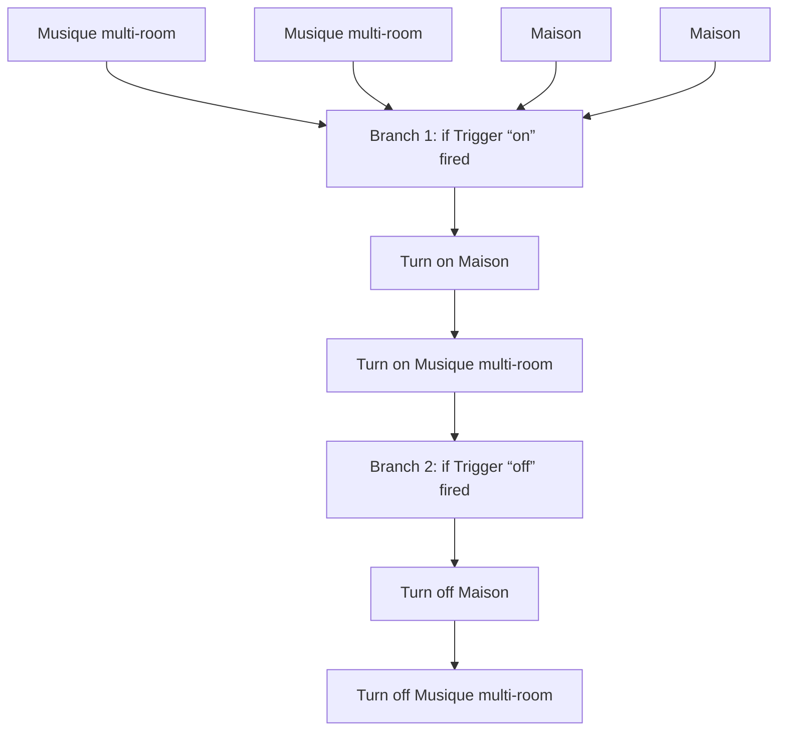
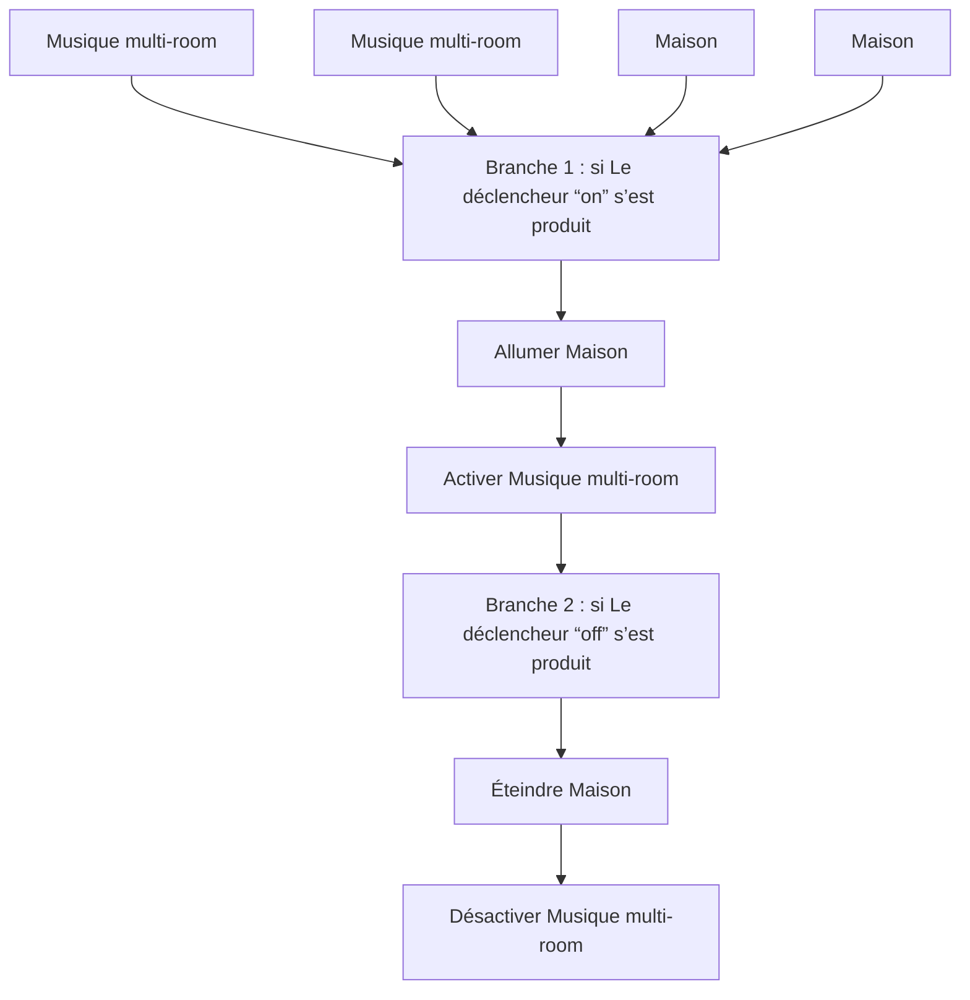

# Musique Multi-room: Allumer / Éteindre / Musique Multi-room: Allumer / Éteindre

## English
- Back to guest-friendly view: [voice_commands](../../../aspects/voice_commands.md)
- Back to technical aspect index: [voice_commands](../voice_commands.md)

### Summary
- Runs when: Musique multi-room; Musique multi-room; Maison; Maison
- Only if: No extra conditions
- Then: Branch 1: if Trigger “on” fired; Turn on Maison; Turn on Musique multi-room; Branch 2: if Trigger “off” fired; Turn off Maison; Turn off Musique multi-room

## Français
- Retour vers la vue “invité” : [voice_commands](../../../aspects/voice_commands.md)
- Retour vers l’index technique de l’aspect : [voice_commands](../voice_commands.md)

### Résumé
- Se déclenche quand : Musique multi-room; Musique multi-room; Maison; Maison
- Uniquement si : Pas de condition supplémentaire
- Ensuite : Branche 1 : si Le déclencheur “on” s’est produit; Allumer Maison; Activer Musique multi-room; Branche 2 : si Le déclencheur “off” s’est produit; Éteindre Maison; Désactiver Musique multi-room

