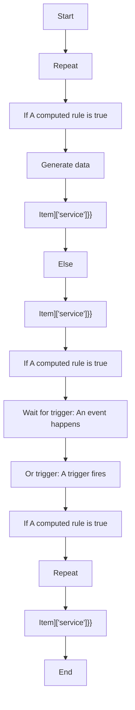
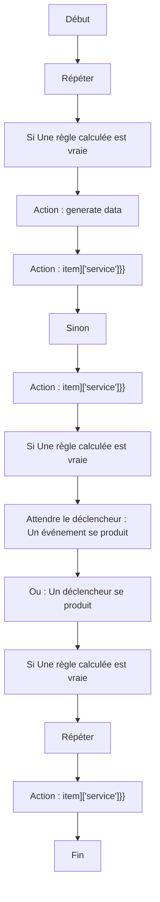

# jlo/power_notification_creator.yaml / jlo/power_notification_creator.yaml

## English
- Source file: `blueprints/script/jlo/power_notification_creator.yaml`

### Power Notification Creator

Send powerfull notifications that discard themselves to the people of the home depending on where they are. This blueprint must be used everytime you want to configure a new notification. It will create a script that you can call everytime you want to send it.

### Inputs
- `advanced_section`
- `button`
- `content`
- `discard`
- `target`

### What the blueprint does (high level)
- Repeat
- If A computed rule is true
- Generate data
- Item]['service']}}
- Else
- Item]['service']}}
- If A computed rule is true
- Wait for trigger: An event happens
- Or trigger: A trigger fires
- If A computed rule is true
- Repeat
- Item]['service']}}

## Français
- Fichier source : `blueprints/script/jlo/power_notification_creator.yaml`

### Power Notification Creator

Send powerfull notifications that discard themselves to the people of the home depending on where they are. This blueprint must be used everytime you want to configure a new notification. It will create a script that you can call everytime you want to send it.

### Entrées
- `advanced_section`
- `button`
- `content`
- `discard`
- `target`

### Ce que fait le blueprint (niveau simple)
- Répéter
- Si Une règle calculée est vraie
- Action : generate data
- Action : item]['service']}}
- Sinon
- Action : item]['service']}}
- Si Une règle calculée est vraie
- Attendre le déclencheur : Un événement se produit
- Ou : Un déclencheur se produit
- Si Une règle calculée est vraie
- Répéter
- Action : item]['service']}}

