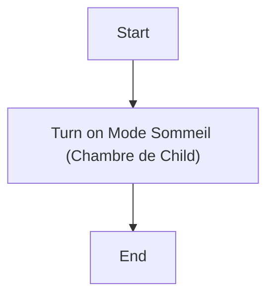
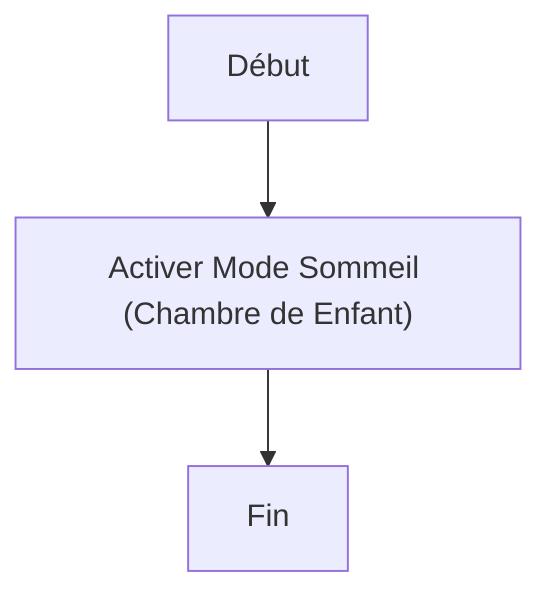

# Activer le mode sommeil de Child / Activer le mode sommeil de Enfant

## English
### Steps (high level)
- Turn on Mode Sommeil (Chambre de Child)

## Français
### Étapes (niveau simple)
- Activer Mode Sommeil (Chambre de Enfant)

