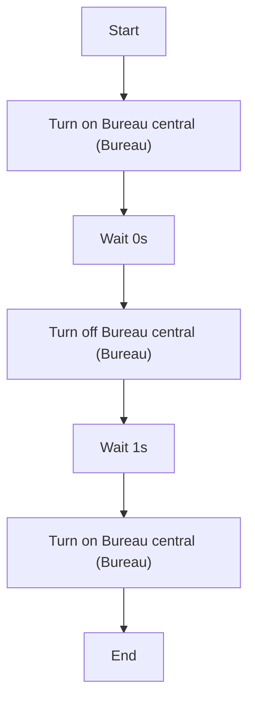
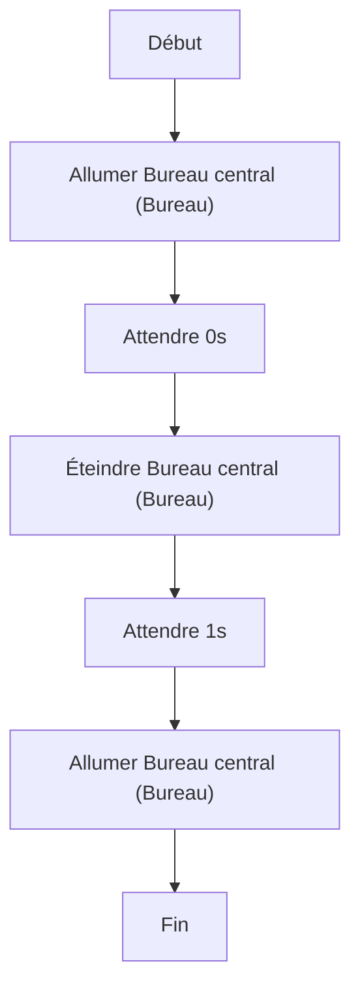

# Clignoter le bureau / Clignoter le bureau

## English
### Steps (high level)
- Turn on Bureau central (Bureau)
- Wait 0s
- Turn off Bureau central (Bureau)
- Wait 1s
- Turn on Bureau central (Bureau)

## Français
### Étapes (niveau simple)
- Allumer Bureau central (Bureau)
- Attendre 0s
- Éteindre Bureau central (Bureau)
- Attendre 1s
- Allumer Bureau central (Bureau)

