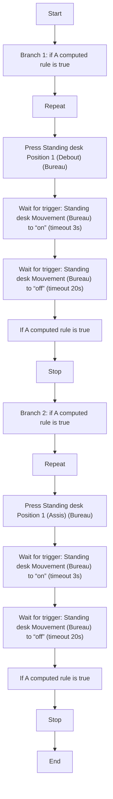
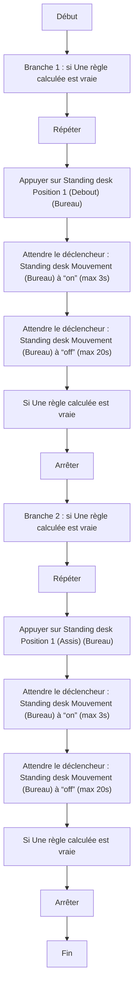

# Controler le Standing desk / Controler le Standing desk

## English
### Steps (high level)
- Branch 1: if A computed rule is true
- Repeat
- Press Standing desk Position 1 (Debout) (Bureau)
- Wait for trigger: Standing desk Mouvement (Bureau) to “on” (timeout 3s)
- Wait for trigger: Standing desk Mouvement (Bureau) to “off” (timeout 20s)
- If A computed rule is true
- Stop
- Branch 2: if A computed rule is true
- Repeat
- Press Standing desk Position 1 (Assis) (Bureau)
- Wait for trigger: Standing desk Mouvement (Bureau) to “on” (timeout 3s)
- Wait for trigger: Standing desk Mouvement (Bureau) to “off” (timeout 20s)
- If A computed rule is true
- Stop

## Français
### Étapes (niveau simple)
- Branche 1 : si Une règle calculée est vraie
- Répéter
- Appuyer sur Standing desk Position 1 (Debout) (Bureau)
- Attendre le déclencheur : Standing desk Mouvement (Bureau) à “on” (max 3s)
- Attendre le déclencheur : Standing desk Mouvement (Bureau) à “off” (max 20s)
- Si Une règle calculée est vraie
- Arrêter
- Branche 2 : si Une règle calculée est vraie
- Répéter
- Appuyer sur Standing desk Position 1 (Assis) (Bureau)
- Attendre le déclencheur : Standing desk Mouvement (Bureau) à “on” (max 3s)
- Attendre le déclencheur : Standing desk Mouvement (Bureau) à “off” (max 20s)
- Si Une règle calculée est vraie
- Arrêter

