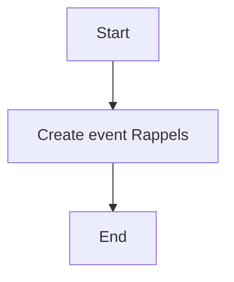
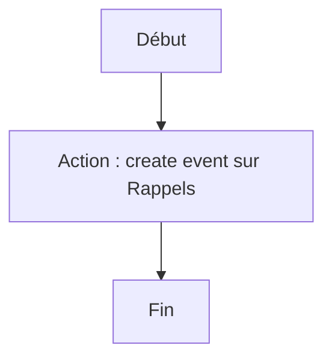

# Create Date Time Reminder / Create Date Time Reminder

## English
### Steps (high level)
- Create event Rappels

```mermaid
flowchart TD
  S["Start"]
  N1["Create event Rappels"]
  E["End"]
  S --> N1
  N1 --> E
```

## Français
### Étapes (niveau simple)
- Action : create event sur Rappels

```mermaid
flowchart TD
  S["Début"]
  N1["Action : create event sur Rappels"]
  E["Fin"]
  S --> N1
  N1 --> E
```
