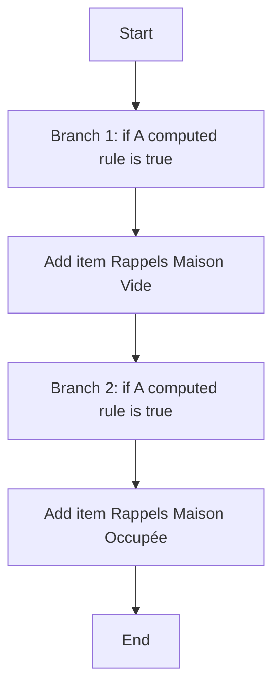
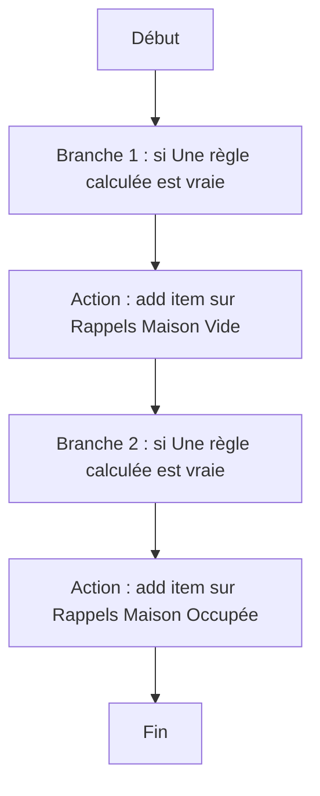

# Create Location Based Reminder / Create Location Based Reminder

## English
### Steps (high level)
- Branch 1: if A computed rule is true
- Add item Rappels Maison Vide
- Branch 2: if A computed rule is true
- Add item Rappels Maison Occupée

## Français
### Étapes (niveau simple)
- Branche 1 : si Une règle calculée est vraie
- Action : add item sur Rappels Maison Vide
- Branche 2 : si Une règle calculée est vraie
- Action : add item sur Rappels Maison Occupée

