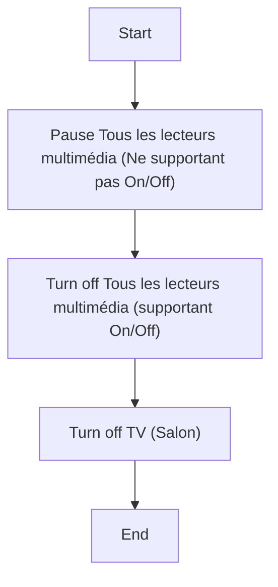
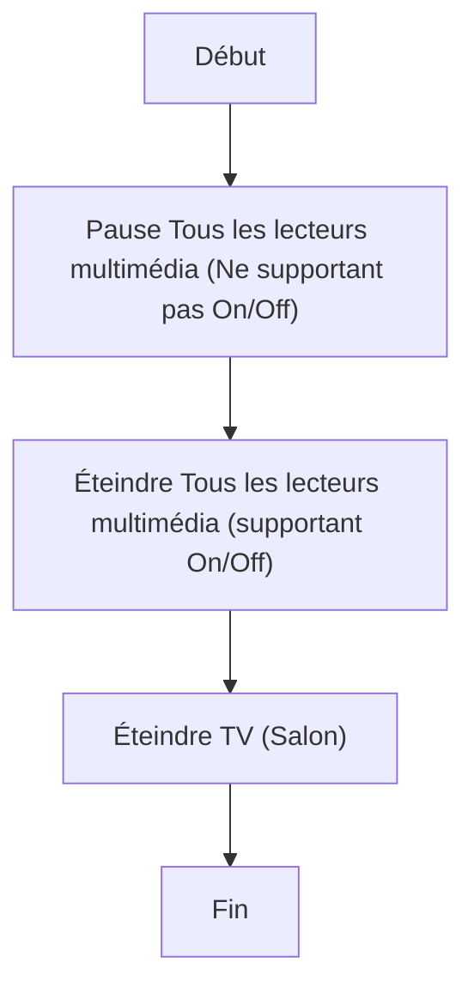

# Éteindre tous les lecteurs multimédia / Éteindre tous les lecteurs multimédia

## English
### Steps (high level)
- Pause Tous les lecteurs multimédia (Ne supportant pas On/Off)
- Turn off Tous les lecteurs multimédia (supportant On/Off)
- Turn off TV (Salon)

## Français
### Étapes (niveau simple)
- Pause Tous les lecteurs multimédia (Ne supportant pas On/Off)
- Éteindre Tous les lecteurs multimédia (supportant On/Off)
- Éteindre TV (Salon)

