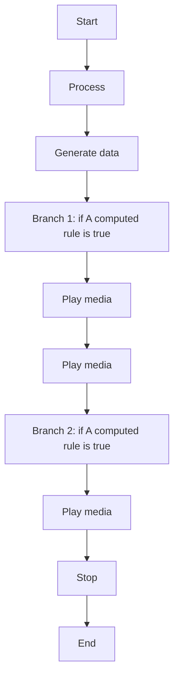
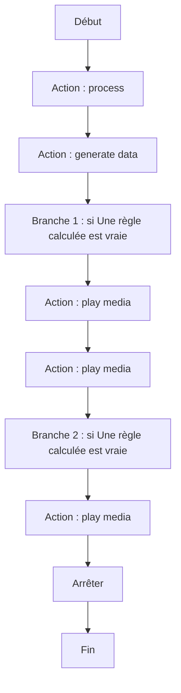

# Jouer de la musique (Music Assistant) / Jouer de la musique (Music Assistant)

## English
### Steps (high level)
- Process
- Generate data
- Branch 1: if A computed rule is true
- Play media
- Play media
- Branch 2: if A computed rule is true
- Play media
- Stop

## Français
### Étapes (niveau simple)
- Action : process
- Action : generate data
- Branche 1 : si Une règle calculée est vraie
- Action : play media
- Action : play media
- Branche 2 : si Une règle calculée est vraie
- Action : play media
- Arrêter

