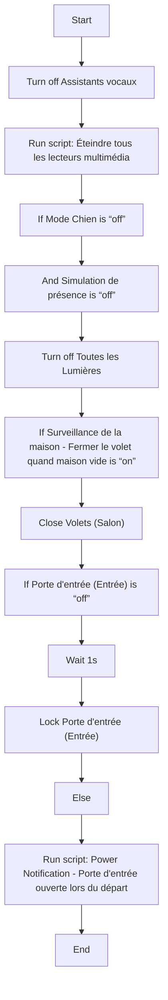
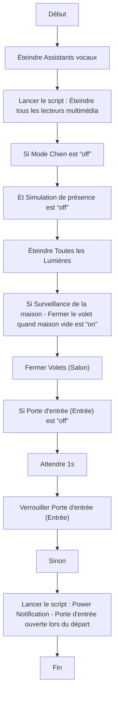

# Éteindre et Sécuriser la maison / Éteindre et Sécuriser la maison

## English
### Steps (high level)
- Turn off Assistants vocaux
- Run script: Éteindre tous les lecteurs multimédia
- If Mode Chien is “off”
- And Simulation de présence is “off”
- Turn off Toutes les Lumières
- If Surveillance de la maison - Fermer le volet quand maison vide is “on”
- Close Volets (Salon)
- If Porte d'entrée (Entrée) is “off”
- Wait 1s
- Lock Porte d'entrée (Entrée)
- Else
- Run script: Power Notification - Porte d'entrée ouverte lors du départ

### Scripts called
- [Éteindre tous les lecteurs multimédia](eteindre_tous_les_lecteur_multimedia.md)
- [Power Notification - Porte d'entrée ouverte lors du départ](power_notification_porte_d_entree_ouverte.md)

## Français
### Étapes (niveau simple)
- Éteindre Assistants vocaux
- Lancer le script : Éteindre tous les lecteurs multimédia
- Si Mode Chien est “off”
- Et Simulation de présence est “off”
- Éteindre Toutes les Lumières
- Si Surveillance de la maison - Fermer le volet quand maison vide est “on”
- Fermer Volets (Salon)
- Si Porte d'entrée (Entrée) est “off”
- Attendre 1s
- Verrouiller Porte d'entrée (Entrée)
- Sinon
- Lancer le script : Power Notification - Porte d'entrée ouverte lors du départ

### Scripts appelés
- [Éteindre tous les lecteurs multimédia](eteindre_tous_les_lecteur_multimedia.md)
- [Power Notification - Porte d'entrée ouverte lors du départ](power_notification_porte_d_entree_ouverte.md)

