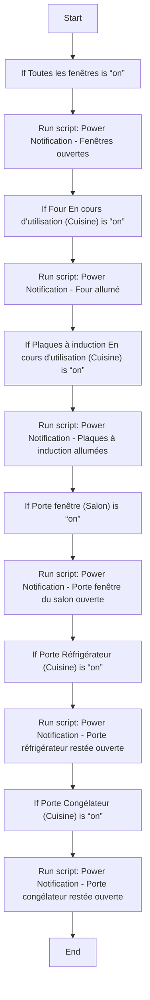
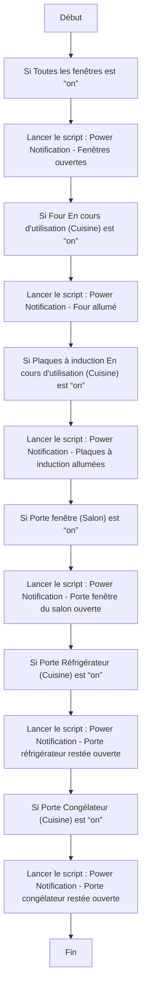

# Préparer départ maison / Préparer départ maison

## English
### Steps (high level)
- If Toutes les fenêtres is “on”
- Run script: Power Notification - Fenêtres ouvertes
- If Four En cours d'utilisation (Cuisine) is “on”
- Run script: Power Notification - Four allumé
- If Plaques à induction En cours d'utilisation (Cuisine) is “on”
- Run script: Power Notification - Plaques à induction allumées
- If Porte fenêtre (Salon) is “on”
- Run script: Power Notification - Porte fenêtre du salon ouverte
- If Porte Réfrigérateur (Cuisine) is “on”
- Run script: Power Notification - Porte réfrigérateur restée ouverte
- If Porte Congélateur (Cuisine) is “on”
- Run script: Power Notification - Porte congélateur restée ouverte

### Scripts called
- [Power Notification - Fenêtres ouvertes](power_notification_fenetres_ouvertes.md)
- [Power Notification - Four allumé](power_notification_four_allume.md)
- [Power Notification - Plaques à induction allumées](power_notification_plaques_a_induction_allumees.md)
- [Power Notification - Porte congélateur restée ouverte](power_notification_porte_congelateur_restee_ouverte.md)
- [Power Notification - Porte fenêtre du salon ouverte](power_notification_porte_fenetre_du_salon_ouverte.md)
- [Power Notification - Porte réfrigérateur restée ouverte](power_notification_porte_refrigerateur_restee_ouverte.md)

## Français
### Étapes (niveau simple)
- Si Toutes les fenêtres est “on”
- Lancer le script : Power Notification - Fenêtres ouvertes
- Si Four En cours d'utilisation (Cuisine) est “on”
- Lancer le script : Power Notification - Four allumé
- Si Plaques à induction En cours d'utilisation (Cuisine) est “on”
- Lancer le script : Power Notification - Plaques à induction allumées
- Si Porte fenêtre (Salon) est “on”
- Lancer le script : Power Notification - Porte fenêtre du salon ouverte
- Si Porte Réfrigérateur (Cuisine) est “on”
- Lancer le script : Power Notification - Porte réfrigérateur restée ouverte
- Si Porte Congélateur (Cuisine) est “on”
- Lancer le script : Power Notification - Porte congélateur restée ouverte

### Scripts appelés
- [Power Notification - Fenêtres ouvertes](power_notification_fenetres_ouvertes.md)
- [Power Notification - Four allumé](power_notification_four_allume.md)
- [Power Notification - Plaques à induction allumées](power_notification_plaques_a_induction_allumees.md)
- [Power Notification - Porte congélateur restée ouverte](power_notification_porte_congelateur_restee_ouverte.md)
- [Power Notification - Porte fenêtre du salon ouverte](power_notification_porte_fenetre_du_salon_ouverte.md)
- [Power Notification - Porte réfrigérateur restée ouverte](power_notification_porte_refrigerateur_restee_ouverte.md)

