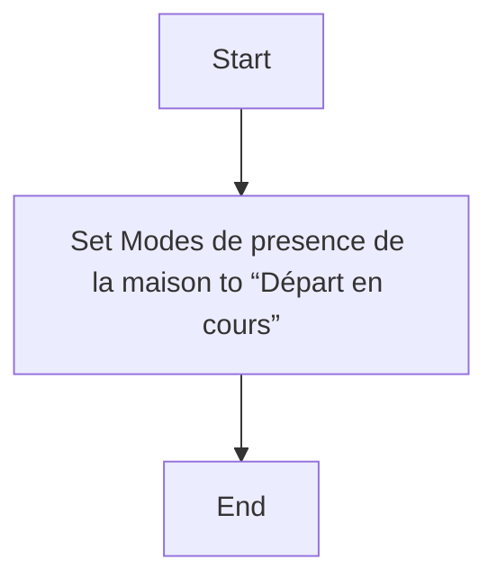
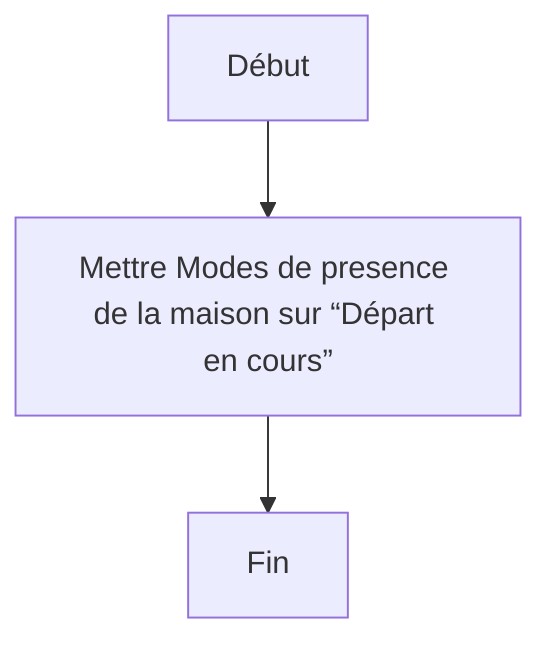

# Départ en cours / Départ en cours

## English
### Steps (high level)
- Set Modes de presence de la maison to “Départ en cours”

## Français
### Étapes (niveau simple)
- Mettre Modes de presence de la maison sur “Départ en cours”

