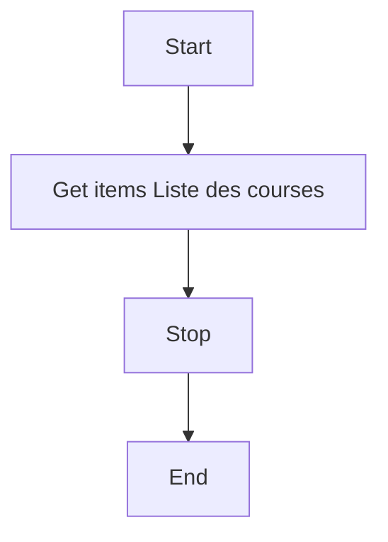
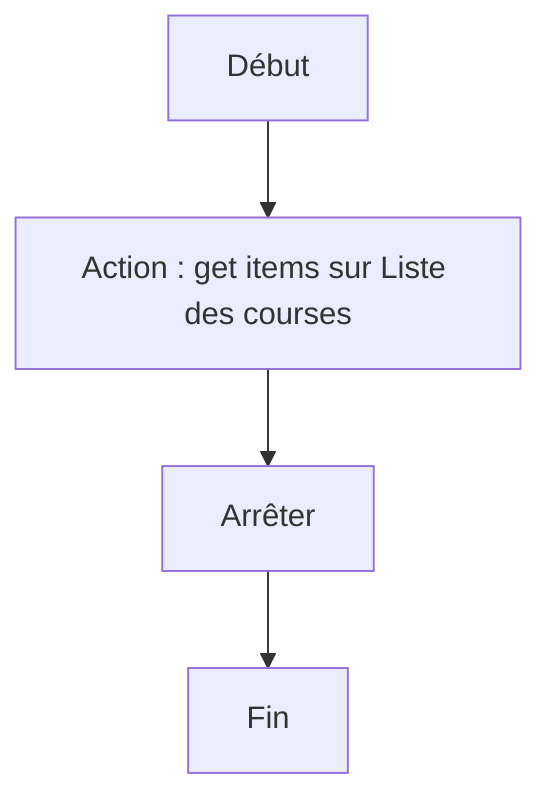

# Récupérer liste de course / Récupérer liste de course

## English
### Steps (high level)
- Get items Liste des courses
- Stop

## Français
### Étapes (niveau simple)
- Action : get items sur Liste des courses
- Arrêter

