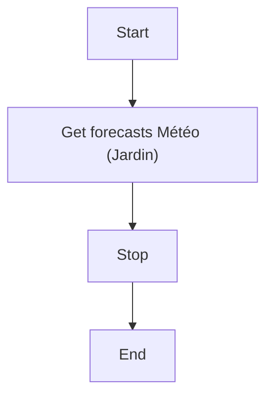
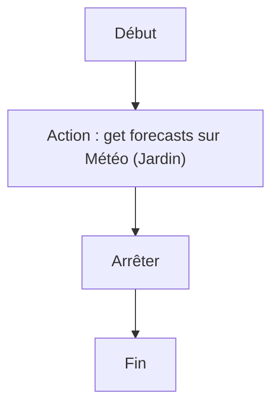

# Récupérer prévisions météorologiques / Récupérer prévisions météorologiques

## English
### Steps (high level)
- Get forecasts Météo (Jardin)
- Stop

## Français
### Étapes (niveau simple)
- Action : get forecasts sur Météo (Jardin)
- Arrêter

