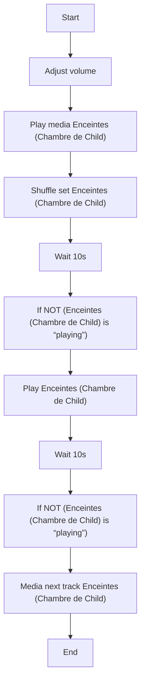
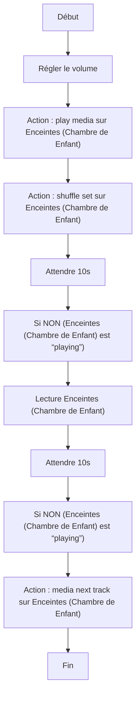

# Démarrer la routine du sommeil de Child / Démarrer la routine du sommeil de Enfant

## English
### Steps (high level)
- Adjust volume
- Play media Enceintes (Chambre de Child)
- Shuffle set Enceintes (Chambre de Child)
- Wait 10s
- If NOT (Enceintes (Chambre de Child) is “playing”)
- Play Enceintes (Chambre de Child)
- Wait 10s
- If NOT (Enceintes (Chambre de Child) is “playing”)
- Media next track Enceintes (Chambre de Child)

## Français
### Étapes (niveau simple)
- Régler le volume
- Action : play media sur Enceintes (Chambre de Enfant)
- Action : shuffle set sur Enceintes (Chambre de Enfant)
- Attendre 10s
- Si NON (Enceintes (Chambre de Enfant) est “playing”)
- Lecture Enceintes (Chambre de Enfant)
- Attendre 10s
- Si NON (Enceintes (Chambre de Enfant) est “playing”)
- Action : media next track sur Enceintes (Chambre de Enfant)

