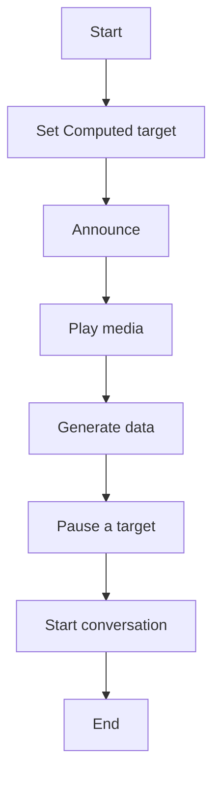
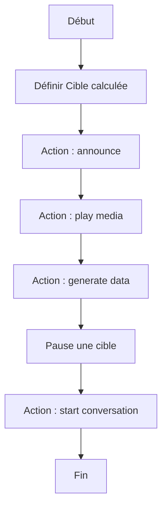

# Start Escape Game / Start Escape Game

## English
### Steps (high level)
- Set Computed target
- Announce
- Play media
- Generate data
- Pause a target
- Start conversation

## Français
### Étapes (niveau simple)
- Définir Cible calculée
- Action : announce
- Action : play media
- Action : generate data
- Pause une cible
- Action : start conversation

