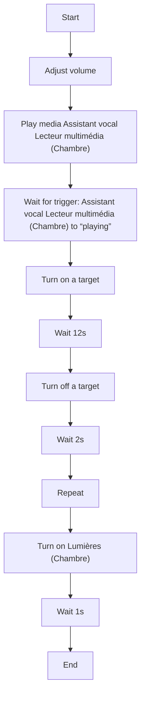
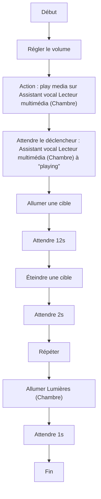

# Crazy Wake Up / Crazy Wake Up

## English
### Steps (high level)
- Adjust volume
- Play media Assistant vocal Lecteur multimédia (Chambre)
- Wait for trigger: Assistant vocal Lecteur multimédia (Chambre) to “playing”
- Turn on a target
- Wait 12s
- Turn off a target
- Wait 2s
- Repeat
- Turn on Lumières (Chambre)
- Wait 1s

## Français
### Étapes (niveau simple)
- Régler le volume
- Action : play media sur Assistant vocal Lecteur multimédia (Chambre)
- Attendre le déclencheur : Assistant vocal Lecteur multimédia (Chambre) à “playing”
- Allumer une cible
- Attendre 12s
- Éteindre une cible
- Attendre 2s
- Répéter
- Allumer Lumières (Chambre)
- Attendre 1s

