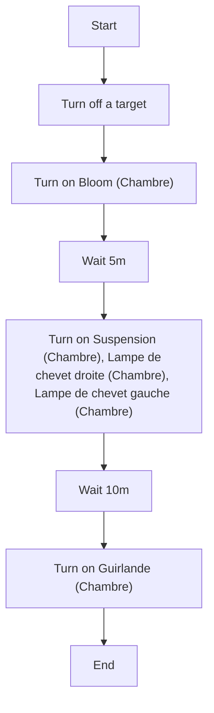
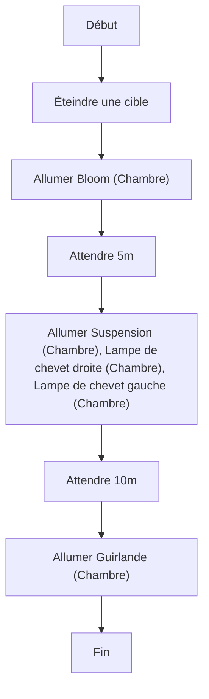

# Réveil Lumineux - Lumières / Réveil Lumineux - Lumières

## English
### Steps (high level)
- Turn off a target
- Turn on Bloom (Chambre)
- Wait 5m
- Turn on Suspension (Chambre), Lampe de chevet droite (Chambre), Lampe de chevet gauche (Chambre)
- Wait 10m
- Turn on Guirlande (Chambre)

## Français
### Étapes (niveau simple)
- Éteindre une cible
- Allumer Bloom (Chambre)
- Attendre 5m
- Allumer Suspension (Chambre), Lampe de chevet droite (Chambre), Lampe de chevet gauche (Chambre)
- Attendre 10m
- Allumer Guirlande (Chambre)

