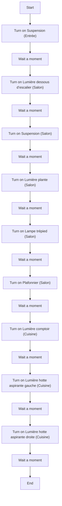
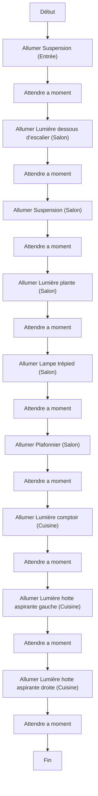

# Allumer progressivement les lumières du rez-de-chaussée / Allumer progressivement les lumières du rez-de-chaussée

## English
### Steps (high level)
- Turn on Suspension (Entrée)
- Wait a moment
- Turn on Lumière dessous d’escalier (Salon)
- Wait a moment
- Turn on Suspension (Salon)
- Wait a moment
- Turn on Lumière plante (Salon)
- Wait a moment
- Turn on Lampe trépied (Salon)
- Wait a moment
- Turn on Plafonnier (Salon)
- Wait a moment
- Turn on Lumière comptoir (Cuisine)
- Wait a moment
- Turn on Lumière hotte aspirante gauche (Cuisine)
- Wait a moment
- Turn on Lumière hotte aspirante droite (Cuisine)
- Wait a moment
- …

## Français
### Étapes (niveau simple)
- Allumer Suspension (Entrée)
- Attendre a moment
- Allumer Lumière dessous d’escalier (Salon)
- Attendre a moment
- Allumer Suspension (Salon)
- Attendre a moment
- Allumer Lumière plante (Salon)
- Attendre a moment
- Allumer Lampe trépied (Salon)
- Attendre a moment
- Allumer Plafonnier (Salon)
- Attendre a moment
- Allumer Lumière comptoir (Cuisine)
- Attendre a moment
- Allumer Lumière hotte aspirante gauche (Cuisine)
- Attendre a moment
- Allumer Lumière hotte aspirante droite (Cuisine)
- Attendre a moment
- …

